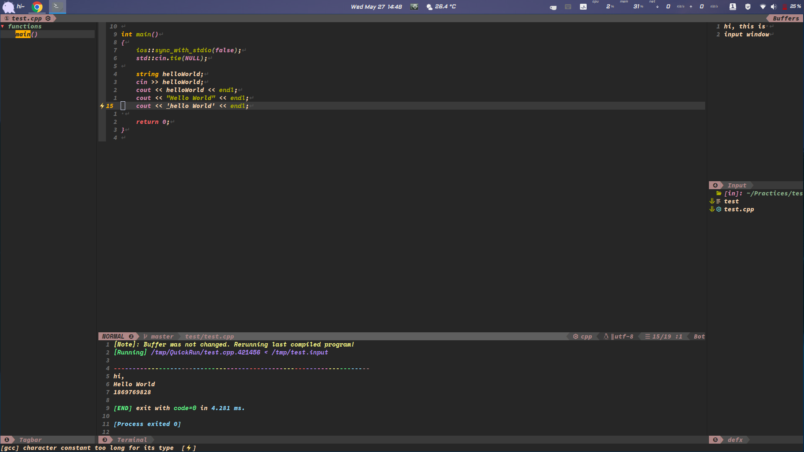
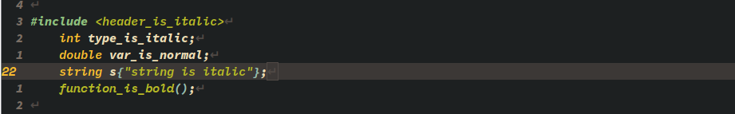
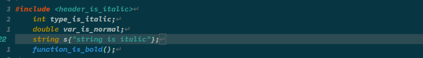
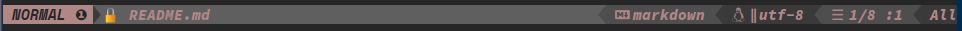
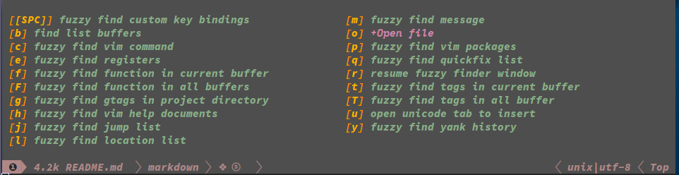
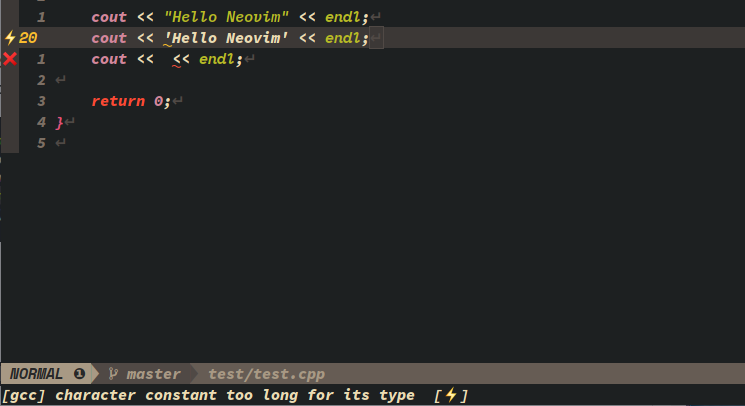
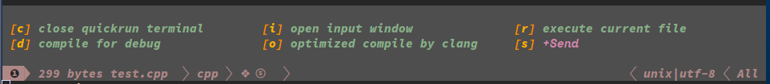
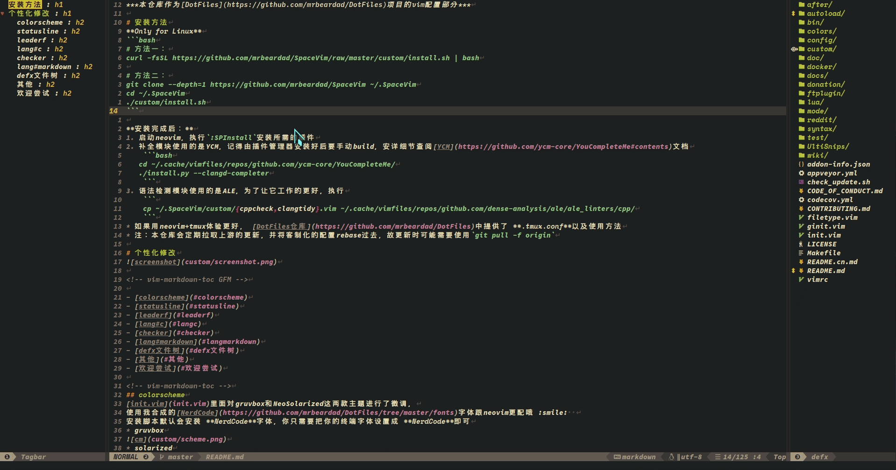

# SpaceVim定制版 :smile:
***本仓库作为[DotFiles](https://github.com/mrbeardad/DotFiles)项目的vim配置部分***

***[使用笔记在此](https://github.com/mrbeardad/DotFiles/blob/master/cheat/vim.md)，列出了几乎所有的操作，你只需看看文档再多用用就OK了***

## 安装方法
**Only for Linux**
```bash
# 方法一：
curl -fsSL https://github.com/mrbeardad/SpaceVim/raw/master/custom/install.sh | bash

# 方法二：
git clone --depth=1 https://github.com/mrbeardad/SpaceVim ~/.SpaceVim
cd ~/.SpaceVim
./custom/install.sh
```

**安装完成后：**
1. 启动neovim，执行`:SPInstall`安装所需的插件
2. 语法检测模块使用的是[ALE](https://github.com/dense-analysis/ale)，
    为了让它工作的更好([见下](#checker))，执行
    ```sh
    cp ~/.SpaceVim/custom/{cppcheck,clangtidy}.vim ~/.cache/vimfiles/repos/github.com/dense-analysis/ale/ale_linters/cpp/
    ```
**注**：本仓库会定期拉取上游的更新，并将客制化的配置rebase过去，故更新时可能需要使用`git pull -f origin`

## 个性化修改



### colorscheme
[init.vim](init.vim)里面对gruvbox和NeoSolarized这两款主题进行了微调，
使用我合并的[NerdCode](https://github.com/mrbeardad/DotFiles/tree/master/fonts)字体跟neovim更配哦 :smile:  
安装脚本默认会安装 **NerdCode**字体，你只需要把你的终端字体设置成 **NerdCode**即可
* gruvbox

* solarized


**注**：只有设置了环境变量`DARKBG`才在启动时会随机使用gruvbox或solarized主题，否则为透明背景主题`default-plus`，
想要启动时就开启这些主题的话，使用命令`DARKBG=1 nvim`即可，当然可以修改`init.vim`一劳永逸，将外分支注释即可

### statusline
原版：

定制：

* 添加的`🔒️`符号，用于提示当前文件为只读

* 文件名是当前文件的全路径去掉工程目录之后得到

* 添加了文件类型图标，spacevim的图标api是根据文件扩展名判断文件类型，经过定制后，
    若根据扩展名无法获取图标，则改为根据文件类型`&ft`

* 光标位置的显示，原版不会显示文件总共的行数

### LeaderF

* 将所有LeaderF模糊搜索的快捷键都绑定到了`<leader>f`开头
* 联用**LeaderF**与**gtags**，使用`<leader>fg`搜索当前项目目录的gtags，
    有时没有自动更新则需要手动执行`:Leaderf --gtags --update`
* 除了gtags，也支持ctags——搜索函数、标签、定义引用都不再话下

### checker
&emsp;语法检测模块我使用的[ALE](https://github.com/dense-analysis/ale)，并且使用了*clang-tidy*，
我启用了clang-tidy的绝大多数checks，所以即使是小的源文件也有点慢。于是我让*clang-tidy*每6次`InsertLeave`触发一次
，而*cppcheck*与*gcc*每次都触发  
&emsp;并且为修改了很多插件，它们的操作会触发`InsertLeave`导致触发ALE，定制后保留原来功能但不触发语法检测。
例如：UltiSnips代码片段补全

  

### lang#c

SpaceVim内建的<a href=## title="SpaceVim用于编译并运行当前编辑文件的组件">runner</a>使用的脚本计时器，
运行时间偏差较大，且输入不方便。  
我用C++写了Linux平台的计时器，
并用bash脚本包装，同时利用了neovim内建终端<div title="别问我为啥就不能用C++11。。我不想改了o(=·ェ·=)m">**需要支持C++17的编译器**</div>

* `<space>lr`：立即运行当前编辑的C/C++文件，默认只编译当前一个TU，不过下面提供了命令用于设置编译参数
    * Neovim中的内建终端有个小bug，执行完程序后只要在终端模式下按任意键就会关闭终端。
        所以我设置了很多终端模式的快捷键用于移动光标和切换窗口，当你在终端内按下这些快捷键时会提前推出终端模式，从而避免关闭终端。
        当然不可能涵盖所有快捷键，所以有时你在执行完程序的终端中按下快捷键会导致终端关闭
    * 若当前缓冲区的文件未改动且硬盘上文件的时间戳相比于上次也未改动，则会直接运行上次编译的文件

* `<space>li`：在右上侧打开输入窗口，待会`<space>lr`运行时，会将运行的程序的`stdin`重定向至输入窗口的文件

* `<space>ld`：编译当前文件，添加了一些 <a href=## title="该参数不受QuickrunArgs控制">参数</a>用于
    GDB调试，[DotFiles](https://github.com/mrbeardad/DotFiles)仓库中也有GDB的配置

* `:QuickrunArgs`：设置程序运行时的参数，例如`:QuickrunArgs --help`则当你按 <kbd>space</kbd>+ <kbd>l</kbd>+
<kbd>r</kbd>运行程序时，相当于shell中`$ cmd --help`

* `:QuickrunCompileFlag`：设置编译参数，c语言默认`-std=c11`，c++默认`-std=c++20`，在`init.vim`里面改

* `:QuickrunRedirect`：设置重定向，例如`> /dev/null < /tmp/input`，当你按 <kbd>space</kbd>+ <kbd>l</kbd>+
<kbd>i</kbd>时，会打开一个input窗口，并自动将程序重定向stdin到该input窗口的文件，离开该窗口时自动写回

* <kbd>K</kbd>它可用于使用[cppman](https://github.com/aitjcize/cppman)查找cpp文档，
    安装cppman：`sudo pip3 install cppman`  
    安装脚本会帮你安装cppman的数据缓存，不然国内得下载半个多小时
* 在写回文件时按字典序自动排序头文件

### lang#markdown
* <kbd>space</kbd>+ <kbd>l</kbd>+ <kbd>p</kbd>：启动浏览器进行markdown及时预览

* <kbd>space</kbd>+ <kbd>l</kbd>+ <kbd>g</kbd>：添加目录`[TOC]`，GFM是不支持目录的
* <kbd>shift</kbd>+ <kbd>tab</kbd>：添加`&emsp;`制表符
* 提供的Ultisnips插件对markdown的补全，在输入触发字符再按 <kbd>Alt</kbd>+ <kbd>/</kbd>即可补全代码片段，
    提供了许多常用的标签，可以打开`UltiSnips`目录查看，写了有注释

### defx文件树
* 在文件树中按 <kbd>P</kbd>键可以触发预览操作，需要安装`ranger`，并且还需要
    * 在`tmux`中运行你的vim/neovim
    * 或者安装了`guake`
> 注意：ranger的配置`~/.config/ranger/rc.conf`只有加了`set show_hidden true`才能在启动时预览隐藏文件，
> Manjaro自带的ranger配置将其设置为了false
* 按 <kbd>F</kbd>使用Leaderf搜索目录
* 按<kbd>O</kbd>使用桌面系统工具来打开目标文件或目录



### 其他
剩下的修改就是些快捷键的更改和一些插件的lazy load  
[使用笔记在此](https://github.com/mrbeardad/DotFiles/blob/master/cheat/vim.md)，常用操作基本上都写了有，
    并且还有一些vim的基础概念

## 欢迎尝试
[使用笔记在此](https://github.com/mrbeardad/DotFiles/blob/master/cheat/vim.md)

