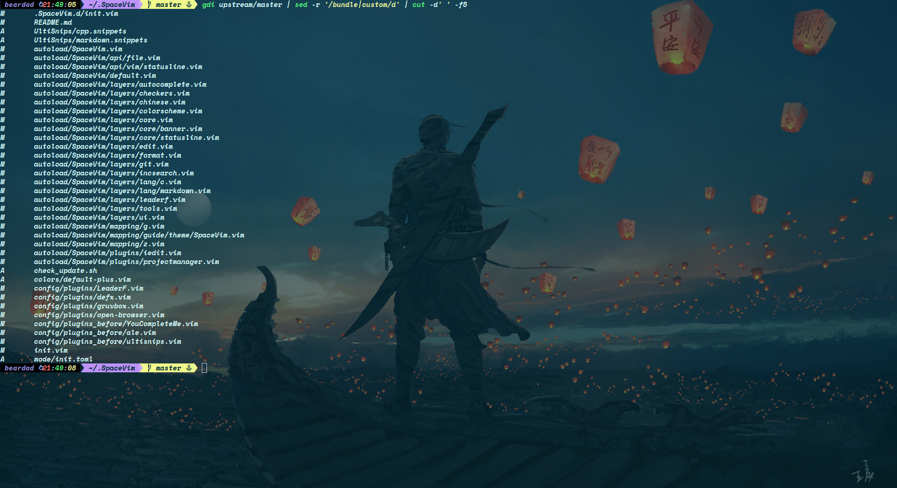
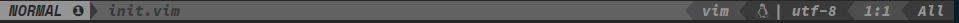

# 写在前面

&emsp;SpaceVim确实是个很棒的配置集合。

&emsp;相比于其他热门vim配置，它的文档更详细，开发更活跃。
而且模块化的设计使得用户可以更方便、更精准地进行自定义，魔改原配置。
虽然作者建议将custom配置写到单独的文件，但编辑器要用得顺手就是要配置的十分个性化嘛，
custom文件显然不能满足，于是就自己动手魔改呗。这时模块化配置就体现出优势了，哪里不顺改那里✺◟(∗❛ัᴗ❛ั∗)◞✺


* * *

接下来按一个个模块来讲解各种特性，含原生也含我自定的。几乎所有的快捷键都在[这个快捷键列表](https://github.com/mrbeardad/DotFiles/blob/master/cheat/vim.md)中列出了

先look~look我改了哪些地方



# 目录
<!-- vim-markdown-toc GFM -->

- [颜色主题](#颜色主题)
- [状态栏](#状态栏)
- [符号表、文件树、撤销树](#符号表文件树撤销树)
- [模糊搜索](#模糊搜索)
- [语法检测](#语法检测)
- [自动补全](#自动补全)
- [C模块](#c模块)
- [Markdown模块](#markdown模块)
- [安装](#安装)
  - [依赖](#依赖)
  - [安装指导](#安装指导)

<!-- vim-markdown-toc -->

# 颜色主题
&emsp;SpaceVim的**colorscheme模块**提供了不少颜色主题。我选取了其中几个比较好看的，
针对C\+\+语法高亮进行微调，当然也包括了对C\+\+语法高亮插件进行了微调。

&emsp;不同的是，C\+\+语法高亮插件的微调直接对插件本身进行了调整，
而对颜色主题的调整全都放在了[init.vim](init.vim)。所以想要使用微调过的颜色主题，
需要在启动nvim时设置环境变量，即执行`DARKBG=1 nvim`即可，不然默认使用透明背景主题default-plus。
要是觉得不方便，则可以简单修改一下[init.vim](init.vim)分支语句即可

&emsp;演示字体为[NerdCode](https://github.com/mrbeardad/DotFiles/tree/master/fonts)，是我将三种字体合成一个font family得到的

**default-plus**  
  

**SpaceVim**  
  

**gruvbox**  
  

**NeoSolarized**  
  

**palenight**
  

**material**
  

# 状态栏

原版：  


定制版：  


**定制版从左至右依次是：**
1. 当前模式

2. 当前分支
3. 当前文件路径，是指相对项目根目录的相对路径，若文件只读还会显示`🔒️`
4. 文件类型
5. 文件格式与编码
6. 当前行号 / 总行数：当前列号
7. 屏幕显示的文本占比

# 符号表、文件树、撤销树
&emsp;符号表插件使用的是[tagbar](https://github.com/wsdjep/tagbar)，按`<F1>`开启  
&emsp;文件树插件使用的是[defx](https://github.com/Shougo/defx.nvim)，按`<F3>`开启  
&emsp;撤销树插件使用的是[undotree](https://github.com/mbbill/undotree)，按`<F3>`开启  
</img>
</img>
</img>


# 模糊搜索
&emsp;该模块使用[Leaderf](https://github.com/Yggdroot/LeaderF)，可以搜索文件、内容、代码符号等等

| 按键               | 作用                    |
|--------------------|-------------------------|
| `<leader>fr`       | 重置上次搜索            |
| `<leader>f<space>` | 搜索快捷键并执行        |
| `<leader>fp`       | 搜索插件信息            |
| `<leader>fh`       | 搜索vim帮助文档         |
| `<leader>fq`       | 搜索quickfix            |
| `<leader>fl`       | 搜索locationlist        |
| `<leader>fm`       | 搜索vim的输出信息并复制 |
| `<leader>fu`       | 搜索unicode并插入       |
| `<leader>fj`       | 搜索跳转表并跳转        |
| `<leader>fy`       | 搜索"寄存器历史并复制   |
| `<leader>fe`       | 搜索所有寄存器并复制    |
| `<leader>ff`       | 搜索函数(尾缀F全局)     |
| `<leader>ft`       | 搜寻符号(尾缀T全局)     |
| `<leader>fg`       | 利用gtags搜寻标识符     |
| `<leader>fb`       | 搜索打开的缓冲区        |
| `<leader>for`      | 搜索最近打开文件        |
| `<leader>fod`      | 搜索当前目录文件        |
| `<leader>fof`      | 搜索指定目录            |
| `<leader>fop`      | 搜索当时工程目录文件    |

# 语法检测
&emsp;语法检测使用[ALE](https://github.com/dense-analysis/ale)插件，会在底部命令行的位置显示报错与警告  


&emsp;C++代码默认标准为C++20设置变量`g:ale_cpp_std`进行修改  

&emsp;该模块会使用[clang-tidy](https://clang.llvm.org/extra/clang-tidy/)作为linter之一来进行语法检测。
默认开启了绝大部分`checks`（设置`g:ale_cpp_clangtidy_checks`进行更改），故它的检测速度相当感人。
默认只有**InsertLeave**自动触发ALE（按`<c-c>`退出插入模式可不触发），每6次触发ALE才会触发一次clang-tidy检测，
设置变量`g:ale_clangtidy_period`进行更改

# 自动补全
&emsp;C++语义补全使用的[YCM](https://github.com/ycm-core/YouCompleteMe)，
可以帮你补全引入头文件中的函数、变量、类、类成员等等。随意输入两个字母就自动打开补全列表，
`<tab>`与`<s-tab>`上下选择，`<cr>`完成选择。刚引入的头文件还需待后台服务进行解析，
故其中的符号可能不会立刻出现在补全列表中，稍等即可。  


&emsp;除了语义补全，还有代码片段补全，插件为[UltiSnips](https://github.com/SirVer/ultisnips)。即按一定的语法编辑snippet配置文件后，再在代码中输入关键字，
然后按`<m-/>`（<kbd>Alt</kbd>+<kbd>/</kbd>）触发，就会将关键字替换为配置文件中的完整片段。  
&emsp;提供的默认片段位于[*UltiSnips*](UltiSnips)文件夹下

# C模块
&emsp;SpaceVim运行程序不会使用内建终端，而且脚本计时器的偏差有点大，所以我重新写了一个Linux平台的计时器，
输出漂漂亮亮的。  

&emsp;**命令：**  
`QuickrunCompileFlag`：显示或设置当前文件的编译参数，例`QuickrunCompileFlag -std=c++20 -mavx2`  
`QuickrunArgs`：显示或设置当前文件的运行时的命令行参数，例`QuickrunArgs -o file`  
`QuickrunRedirect`：显示或设置当前文件的运行时重定向，例`QuickrunRedirect < file`

&emsp;**变量：**  
`g:disable_auto_launch_gdb`：若设置为1，则`<space>ld`仅编译用于调试的程序，而不会自动启动cgdb或gdb

| 按键        | 作用               |
|-------------|--------------------|
| `<space>lr` | 快速运行程序       |
| `<space>lc` | 关闭运行程序的终端 |
| `<space>li` | 快速打开输入窗口   |
| `<space>ld` | 启动cgdb或gdb调试  |
| `K`         | 利用cppman查询手册 |

# Markdown模块
&emsp;[*UltiSnips*](UltiSnips)目录提供了一些markdown的代码补全片段。  
此外，还对markdown的语法高亮进行了调整；  
同时，提供了一些快捷键：

| 按键        | 作用                            |
|-------------|---------------------------------|
| `<space>lp` | 开启markdown预览（需要浏览器）  |
| `<space>lg` | 添加或删除GFM目录               |
| `<space>lk` | 利用系统剪切板的URL插入链接元素 |

# 安装
&emsp;以上就是大概的定制化内容，还有不少比较杂的就不意义列出了，相比原生的SpaceVim需要自己配置，本魔改版本基本上算是开箱即用的，无需自己配置，
你需要做到就是好好阅读[**快捷键文档**](https://github.com/mrbeardad/DotFiles/blob/master/cheat/vim.md)即可

接下来讲讲咋安装

## 依赖
首先，该配置有不少**依赖**需要装：

| 依赖包                    | 作用                              |
|---------------------------|-----------------------------------|
| xsel                      | neovim的系统剪切板交互            |
| python-pynvim             | neovim的python支持                |
| cmake                     | build YCM时需要                   |
| ripgrep                   | 模糊搜索模块的后端工具            |
| global与ctags             | 模糊搜索模块的符号索引            |
| npm或php                  | build markdown即时预览插件        |
| gcc、cppcheck、clang-tidy | 语法检测模块（gcc版本需要大于10） |
| gdb与cgdb                 | 调试                              |
| cppman                    | 联网查询C++手册                   |

此外，想要更好的体验，需要将neovim运行在tmux中，你可以设置你喜欢的终端，使它启动时自动连接tmux。
[tmux的配置可以用这个](https://github.com/mrbeardad/DotFiles/blob/master/tmux/tmux.conf)，
此配置解决了tmux中的true-color与undercrul问题，不然你在tmux例运行neovim是很不美观的。

## 安装指导
**Only for Linux**

注意：执行前需要保证没有`~/.SpaceVim`目录，否则不会下载而直接进行其它步骤
```sh
# 方法一：
curl -fsSL https://github.com/mrbeardad/SpaceVim/raw/master/custom/install.sh | bash

# 方法二：
git clone --depth=1 https://github.com/mrbeardad/SpaceVim ~/.SpaceVim
cd ~/.SpaceVim
./custom/install.sh
```

安装操作会下载[颜色主题](#颜色主题)中提到的[NerdCode字体](https://github.com/mrbeardad/DotFiles/tree/master/fonts)，
同时下载cppman的cplusplus模式的缓存

安装完成后，还有两件事要做：
1. 打开nvim，执行`:SPInstall`安装插件
2. 执行`cp -f ~/.SpaceVim/custom/{clangtidy,cppcheck}.vim ~/.cache/vimfiles/repos/github.com/dense-analysis/ale/ale_linters/c/`修改ALE原配置
