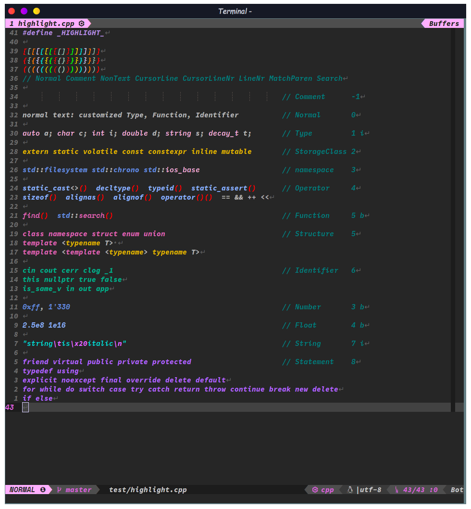
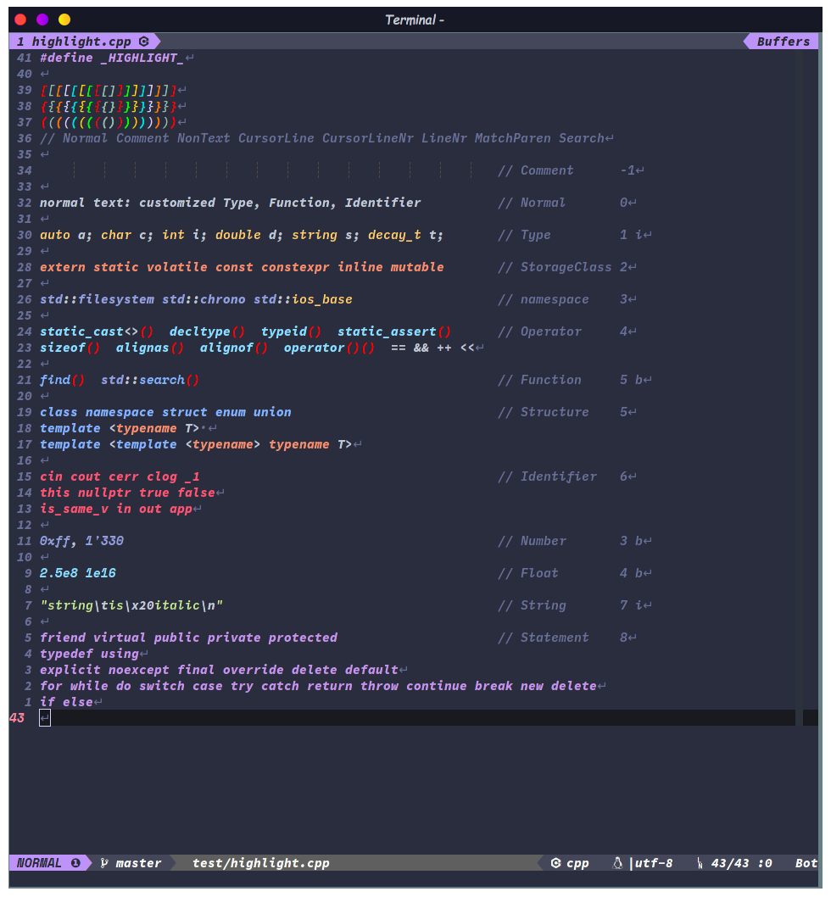

# For Neovim 7.0+
如果你的环境支持neovim7.0+，不妨试试现代neovim全新的LSP+Lua生态，见[MyLunarVim](https://github.com/mrbeardad/MyLunarVim)

# For VSCode User
[见vscode分支](https://github.com/mrbeardad/SpaceVim/tree/vscode)

# 写在前面

&emsp; [SpaceVim](https://github.com/SpaceVim/SpaceVim) 是一个非常棒的配置集合。
相比于其他热门vim配置，SpaceVim开发最活跃，功能最完善，文档最齐全。
模块化的设计使得用户可以更方便、更精准地进行自定义，魔改原配置。
哪里不顺改那里，精准打击✺◟(∗❛ัᴗ❛ั∗)◞✺

* * * * * * * * * *

# 注意注意！敲黑板！[使用手册在此！](keybindings.md)

先look~look我改了哪些地方，然后再按一个个模块来讲解各种特性吧


# 目录
<!-- vim-markdown-toc GFM -->

- [For VSCode User](#for-vscode-user)
- [写在前面](#写在前面)
- [注意注意！敲黑板！使用手册在此！](#注意注意敲黑板使用手册在此)
- [目录](#目录)
- [颜色主题](#颜色主题)
- [启动界面字符画](#启动界面字符画)
- [状态栏与标签栏](#状态栏与标签栏)
- [符号表、文件树、撤销树](#符号表文件树撤销树)
- [高效编辑](#高效编辑)
- [模糊搜索](#模糊搜索)
- [文本搜索](#文本搜索)
- [版本管理](#版本管理)
- [在线翻译](#在线翻译)
- [代码补全](#代码补全)
- [语法检测](#语法检测)
- [代码运行](#代码运行)
- [调试](#调试)
- [Markdown渲染预览](#markdown渲染预览)
- [安装](#安装)

<!-- vim-markdown-toc -->
# 颜色主题
&emsp;SpaceVim的 ***colorscheme模块*** 提供了不少颜色主题。
我将语法高亮与颜色主题都针对C++源码进行了微调。

&emsp;只需要在启动nvim时设置环境变量`DARKBG=1`即可随机启用那些花里胡哨的主题中的一个，
或者类似设置`DARKBG=gruvbox`可指定使用gruvbox主题。
我一般设置命令别名`alias vi='DARKBG=1 nvim'`

&emsp;演示使用[NerdCodePro字体](https://github.com/mrbeardad/DotFiles/tree/master/fonts)，
该字体集成了3种字体于一身，使得regular、bold、italic三种style使用三种不同的字体，
看起来赏心悦目超nice。
> PS：要是所有终端都像alacritty一样支持不同style不同字体，我至于这么折腾自己吗(*￣︿￣)

**SpaceVim**


**gruvbox**


**NeoSolarized**


**palenight**


**material**


# 启动界面字符画
这个模块提供了许多`SpaceVim`启动界面的字符画，拉风的很。而且有惊喜哦>_<


# 状态栏与标签栏
这两个模块提供了状态栏与标签栏的配置，若禁用该模块则会启用备胎[vim-airline](https://github.com/vim-airline/vim-airline)

**标签栏**


左边的每块标签包括：
* 标签号
* 文件名

最右边的表示：
* Buffers：指明左边的标签为buffer
* Tabs：指明左边的标签为tab

**状态栏**


从左至右依次是：
1. 当前vim模式以及窗口号
2. 当前git分支
3. 当前文件相对项目目录的路径（若文件只读还会显示特殊符号锁）
4. 源码语法检错报错
4. 文件类型
5. 文件格式|编码格式
6. 当前行号/总行数 :当前列号
7. 屏幕显示的文本占比（接近文件内容边缘时会显示Bot或Top）

# 符号表、文件树、撤销树
&emsp;符号表插件使用的是[tagbar](https://github.com/wsdjep/tagbar)，按`<F1>`开启
&emsp;文件树插件使用的是[defx](https://github.com/Shougo/defx.nvim)，按`<F2>`开启
&emsp;撤销树插件使用的是[undotree](https://github.com/mbbill/undotree)，按`<F4>`开启
<!-- </img> -->
<!-- </img> -->
<!-- </img> -->


# 高效编辑
提供了许多插件用于快速、舒服地写代码：
* 提供许多额外的文本对象：如`e`（entire）、`i`（indent）、`l`（line）、`f`（function）以及最好用的`,`（表示一个逗号分割的函数参数）

* 提供了快速编辑结对符的插件[vim-surround](https://github.com/tpope/vim-surround)，看官方的演示更好理解用法，该插件可以与文本对象一同作用

* 还提供了一个快速跳转光标的插件（以下只是其功能之一）：


* 虽然这个插件不属于edit模块，但还是放这儿一起show一波吧。[多光标编辑](https://github.com/mg979/vim-visual-multi)，大杀器！


# 模糊搜索
这个模块即是围绕[LeaderF搜索插件](https://github.com/Yggdroot/LeaderF)打造的

SpaceVim集成该插件时做了一些定制，会与上述官方演示有些不一样，不过都是配置好了的，用就完事儿！
| 按键               | 作用                    |
| ------------------ | ----------------------- |
| `<leader>fr`       | 重置上次搜索            |
| `<leader>f<space>` | 搜索快捷键并执行        |
| `<leader>fp`       | 搜索插件信息            |
| `<leader>fh`       | 搜索vim帮助文档         |
| `<leader>fq`       | 搜索quickfix            |
| `<leader>fl`       | 搜索locationlist        |
| `<leader>fm`       | 搜索vim的输出信息并复制 |
| `<leader>fu`       | 搜索unicode并插入       |
| `<leader>fj`       | 搜索跳转表并跳转        |
| `<leader>fy`       | 搜索"寄存器历史并复制   |
| `<leader>fe`       | 搜索所有寄存器并复制    |
| `<leader>ff`       | 搜索当前buffer函数      |
| `<leader>fF`       | 搜索所有buffer函数      |
| `<leader>ft`       | 搜寻当前buffer符号      |
| `<leader>fT`       | 搜寻所有buffer符号      |
| `<leader>fg`       | 利用gtags搜寻标识符     |
| `<leader>sr`       | 搜索最近打开文件        |
| `<leader>sb`       | 搜索打开的缓冲区        |
| `<leader>sd`       | 搜索当前目录文件        |
| `<leader>sf`       | 搜索指定目录            |

| Leaderf界面快捷键 | 功能                             |
| ----------------- | -------------------------------- |
| `<c-e>`           | 切换模糊搜索模式或正则表达式模式 |
| `<c-c>`           | 关闭leaderf                      |

# 文本搜索
flygrep是个集成在SpaceVim里的默认插件，但其功能也不亚于LeaderF，
后者用来搜索文件名、代码符号，flygrep用来搜索文件内容
| 按键        | 作用           |
| ----------- | -------------- |
| `<space>ss` | 搜索当前缓冲区 |
| `<space>sb` | 搜索所有缓冲区 |
| `<space>sd` | 搜索当前目录   |
| `<space>sf` | 搜索指定目录   |
| `<space>sp` | 搜索工程目录   |
| `<space>sd` | 搜索当前目录   |
| `<space>sf` | 搜索指定目录   |
| `<space>sp` | 搜索工程目录   |

| flygrep界面快捷键 | 作用                             |
| ----------------- | -------------------------------- |
| `<c-e>`           | 切换正则搜索模式或字符串锁搜模式 |
| `<m-r>`           | 进入替换模式                     |
| `<c-p>`           | 浮窗预览                         |
| `<c-d>`           | 向下翻页                         |
| `<c-b>`           | 向上翻页                         |
| `<c-c>或<esc>`    | 关闭flygrep                      |


# 版本管理
这俩模块我一半就只用来给statusline加个分支提示，我tmux开个zsh来管理项目不香吗( ◔ ڼ ◔  )

| 快捷键       | 功能                                   |
| ------------ | -------------------------------------- |
| `<space>gg`  | 侧栏显示diff（开启gitgutter）          |
| `<space>ghv` | 浮窗显示diff（需要开启上述gitgutter）  |
| `<space>ghr` | 撤销diff修改 （需要开启上述gitgutter） |


# 在线翻译
提供了vim的中文文档，以及联网翻译器：


# 代码补全
&emsp;语义补全引擎默认使用[YouCompleteMe](https://github.com/ycm-core/YouCompleteMe)。
可以帮你补全命名变量、函数、类、方法等等，任意输入两个字母就自动打开补全列表，
`<tab>`与`<s-tab>`上下选择，`<cr>`完成选择。

&emsp;目前以集成：
* C/C++
* Go
* Python
* Vim
* Bash
* CMake

&emsp;刚引入的头文件还需待后台服务进行解析，
故其中的符号可能不会立刻出现在补全列表中，稍等即可。


&emsp;除了语义补全，还有代码片段补全，插件为[UltiSnips](https://github.com/SirVer/ultisnips)。
即按一定的语法编辑snippet配置文件后，再在代码中输入关键字，
然后按`<M-/>`（<kbd>Alt</kbd>+<kbd>/</kbd>）触发，就会将关键字替换为配置文件中的完整片段。
然后一路`<M-/>`修改锚点
&emsp;提供的默认片段位于[*UltiSnips*](UltiSnips)文件夹下

# 语法检测
&emsp;语法检测主要是利用YCM搭配[ALE](https://github.com/dense-analysis/ale)，
后者通过shell来调用使用静态分析器来进行语法检测。
在底部命令行的位置显示报错与警告，并在边栏显示错误或警告图标，
在错误代码的位置下显示波浪线（若终端不支持undercurl则回滚为underline下划线）

* `g:ale_lint_on_*` ：这几个变量设置何时触发语法检测，用`:h`查看详细信息，
    默认只有文件有改动就会触发


# 代码运行
在`~/.SpaceVim.d/init.toml`中的`[option]`下设置`enable_terminal_runner = true`
即可启用QuickRun替代原版中的Runner来运行程序，QuickRun与后者区别在于：
* 使用内建终端
* 程序运行计时器更加准确
* 设置参数比较方便


&emsp;**命令：**
* 命令以Quickrun开头，如`QuickrunCompileCmd gcc ${file}`表示修改编译命令为`gcc ${file}`，
    `${file}`会被替换为当前文件，其他替换见下
* 命令带`!`后缀表示修改参数

```vim
" 例：
:QuickrunCompileCmd         " 查看当前编译命令
:QuickrunRunCmd!            " 修改运行命令（交互）
:QuickrunRedir < file       " 重定向stdin到file
```

&emsp;**选项：**
```vim
let g:quickrun_default_flags = {
    \ 'cpp': {
        \ 'compileCmd': "g++ -g3 -ggdb3 -D_GLIBCXX_DEBUG -I${fileDirname} -I${workspaceFolder}include -o ${execPath} ${file}",
        \ 'extRegex': [
            \ '\v^#\s*include\s*[<"](pthread\.h|future|thread|.*asio\.hpp|.*gtest\.h)[>"]',
            \ '^#\s*include\s*[<"]dlfcn.h[>"]',
            \ '^#\s*include\s*[<"]pty.h[>"]',
            \ '^#\s*include\s*[<"]boost/locale\.hpp[>"]',
            \ '^#\s*include\s*[<"]*asio/ssl\.hpp[>"]',
            \ '^#\s*include\s*[<"](*asio/co_spawn\.hpp\|coroutine)[>"]',
            \ '^#\s*include\s*[<"]glog/.*[>"]',
            \ '^#\s*include\s*[<"]gtest/.*[>"]',
            \ '^#\s*include\s*[<"]gmock/.*[>"]',
            \ '^#\s*include\s*[<"]mysql++/.*[>"]',
            \ '^#\s*include\s*[<"]srchilite/.*[>"]',
            \ '^#\s*include\s*[<"]fmt/.*[>"]',
        \ ],
        \ 'extFlags': [
            \ '-lpthread',
            \ '-ldl',
            \ '-lutil',
            \ '-lboost_locale',
            \ '-lssl -lcrypto',
            \ '-fcoroutines',
            \ '-lglog',
            \ '-lgtest -lgtest_main',
            \ '-lgmock',
            \ '-I/usr/include/mysql -lmysqlpp',
            \ '-lsource-highlight',
            \ '-lfmt',
        \ ],
        \ 'runCmd': '${execPath}'
    \ },
    \ 'c': {
        \ 'compileCmd': 'gcc -std=c11 -I${fileDirname} -I${workspaceFolder}include -o ${execPath} ${file}',
        \ 'runCmd': '${execPath}'
    \ },
    \ 'python': {
        \ 'runCmd': 'python ${file}'
    \},
    \ 'go': {
        \ 'compileCmd': 'go build -o ${execPath} ${file}',
        \ 'runCmd': '${execPath}'
        \ }
\ }
```

| 按键        | 作用                                   |
| ----------- | -------------------------------------- |
| `<space>lr` | 运行程序（若时间戳较未变则不编译）     |
| `<space>lR` | 强制编译并运行程序                     |
| `<space>li` | 快速打开输入窗口                       |
| `<F10>`     | 开启或关闭程序运行窗口（如果存在的话） |

**注意**：`<space>li`快速打开窗口，会自动使用 QuickrunRedirect命令将当前buffer将要运行的程序重定向到该输入窗口。
离开输入窗口时会自动写回硬盘。

**注意**：对于C++，补全引擎YCM、语法检测引擎ALE、快速运行程序Runner所需要的默认C++标准都由
YCM读取的`.ycm_extra_conf.py`中设置的标准确定，该文件从源文件目录开始向上搜索，若无此文件则默认C++20

**注意**：对于C++，`<space>ll`手动启动所有linter进行静态语法解析，包括clang-tidy（这家伙启动所有checker后太慢了）

# 调试
调试模块基于[vimspector](https://github.com/puremourning/vimspector)


| 按键     | 作用           |
| -------- | -------------- |
| `<F5>`   | 继续           |
| `<S-F5>` | 暂停           |
| `<F6>`   | 重启           |
| `<S-F6>` | 停止           |
| `<F7>`   | Step Over      |
| `<S-F7>` | Step to Cursor |
| `<F8>`   | Step Into      |
| `<S-F8>` | Step Out       |
| `<F9>`   | 设置断点       |
| `<S-F9>` | 设置函数断点   |
| `<C-F9>` | 设置条件断点   |
| `<F9>`   | 设置断点       |
| `<S-F9>` | 设置函数断点   |
| `<C-F9>` | 设置条件断点   |

# Markdown渲染预览
&emsp;[*UltiSnips目录*](UltiSnips)提供了一些markdown的代码补全片段。
此外，还对markdown的语法高亮进行了调整；

| 按键        | 作用                            |
| ----------- | ------------------------------- |
| `<space>lp` | 开启markdown预览（需要浏览器）  |
| `<space>lg` | 添加或删除GFM目录               |
| `<space>lk` | 利用系统剪切板的URL插入链接元素 |

# 安装
以上仅列出部分功能，其他功能需要好好阅读[**快捷键文档**](keysbindings.md)即可

**Only for Linux**

```sh
git clone --depth=1 https://github.com/mrbeardad/SpaceVim ~/.SpaceVim
ln -svf ~/.SpaceVim ~/.config/nvim
ln -svf ~/.SpaceVim/mode ~/.SpaceVim.d
g++ -O3 -std=c++11 -o ~/.local/bin/quickrun_time ~/.SpaceVim/custom/quickrun_time.cpp
# 启动neovim后执行 :SPInstall  安装插件
nvim
# 构建YCM代码补全引擎，如果需要其他语言的语义补全，见 ./install.py --help
cd ~/.cache/vimfiles/repos/github.com/ycm-core/YouCompleteMe/
./install.py --clangd-completer --go-completer
# 修改ALE语法检测引擎
cp -vf ~/.SpaceVim/custom/clangtidy.vim ~/.cache/vimfiles/repos/github.com/dense-analysis/ale/ale_linters/cpp/clangtidy.vim
```

| -------------------------------- | ----------------------------- |
| 依赖包                           | 作用                          |
| -------------------------------- | ----------------------------- |
| neovim                           | 本配置仅适用于neovim而非vim   |
| xsel                             | neovim与X系统剪切板交互       |
| python-pynvim                    | neovim的python支持            |
| ripgrep                          | 模糊搜索模块的后端工具        |
| global、ctags                    | 符号索引                      |
| npm                              | 构建markdown-preview.nvim需要 |
| cmake                            | 构建YCM时需要                 |
| cmake-language-server            | CMake语法补全                 |
| gcc、cppcheck、clang-tidy        | C模块                         |
| go、delve                        | Go模块                        |
| python、pylint、bandit           | Python模块                    |
| shellcheck、bash-language-server | Sh模块                        |
| vint、vim-language-server        | Vim模块                       |

&emsp;此外，想要更好的体验，可以将neovim运行在tmux中，你可以设置你喜欢的终端，使它启动时自动连接tmux。
[tmux的配置可以用这个](https://github.com/mrbeardad/DotFiles/blob/master/tmux/tmux.conf)，
此配置解决了tmux中的true-color、undercrul和vim映射冲突等问题，不然你在tmux例运行neovim体验可是不太好。

