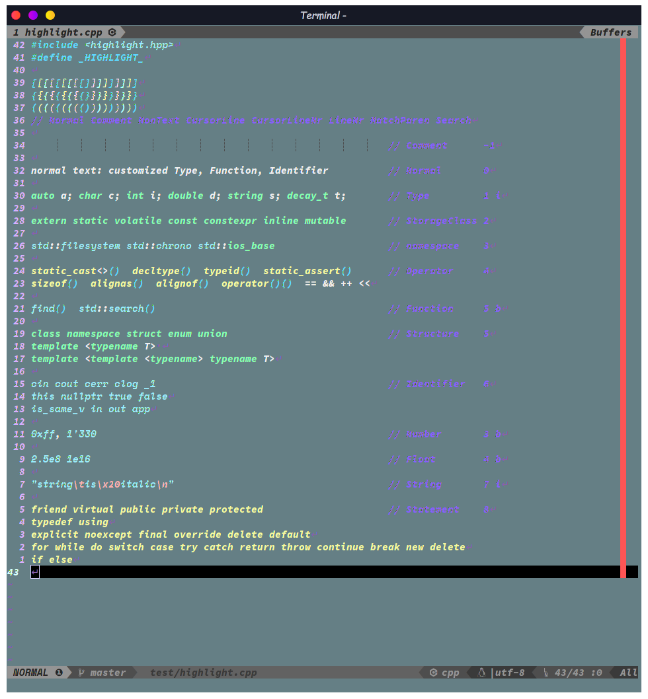

# 写在前面

&emsp; **SpaceVim** 确实是个很棒的配置集合。相比于其他热门vim配置，它的文档更详细，开发更活跃，
而且模块化的设计使得用户可以更方便、更精准地进行自定义，魔改原配置。
虽然作者建议将custom配置写到单独的文件，但编辑器要用得顺手就是要配置的十分个性化嘛，
custom文件显然不能满足，于是就自己动手魔改呗。这时模块化配置就体现出优势了，哪里不顺改那里，精准打击✺◟(∗❛ัᴗ❛ั∗)◞✺

PS: 本配置适用于 **NeoVim** ，Vim的话有许多功能还未支持

* * *

几乎所有的快捷键都在[<u>**这个快捷键列表**</u>](https://github.com/mrbeardad/SeeCheatSheets/blob/master/vim.md)中列出了，
里面同时包含了vim自带快捷键、SpaceVim原版快捷键以及本魔改版快捷键。
先look~look我改了哪些地方：  
  

接下来就按一个个模块来讲解各种特性吧
# 目录
<!-- vim-markdown-toc GFM -->

- [colorscheme](#colorscheme)
- [core#banner](#corebanner)
- [core#statusline,core#tabline](#corestatuslinecoretabline)
- [符号表、文件树、撤销树](#符号表文件树撤销树)
- [incsearch](#incsearch)
- [edit](#edit)
- [leaderf](#leaderf)
- [flygrep](#flygrep)
- [VersionControl](#versioncontrol)
- [checker](#checker)
- [autocomplete](#autocomplete)
- [chinese](#chinese)
- [runner](#runner)
- [lang#c](#langc)
- [lang#markdown](#langmarkdown)
- [自定义](#自定义)
- [安装](#安装)
  - [依赖](#依赖)
  - [安装指导](#安装指导)

<!-- vim-markdown-toc -->
# colorscheme
&emsp;SpaceVim的 ***colorscheme模块*** 提供了不少颜色主题。我选取了其中几个比较好看的，
针对C++语法高亮进行微调，同时也对C++语法高亮插件进行了微调。  
&emsp;只需要在启动nvim时设置环境变量`DARKBG`即可随机启用那些花里胡哨的主题中的一个，
可以将`alias vi='DARKBG=1 nvim'`加入你的 *.bashrc|.zshrc* ，
不然默认使用透明背景主题 *default-reduce* 。

**default-reduce**
（该主题关闭了nvim的终端真色支持，从而使用终端的配色方案）  


**default-plus**  
  

**SpaceVim**  
  

**gruvbox**  
  

**NeoSolarized**  
  

**palenight**
  

**material**
  

# core#banner
这个模块提供了许多`SpaceVim`启动界面的字符画，拉风的很。
> 有惊喜哦>_<


# core#statusline,core#tabline
这个模块提供了状态栏与标签栏的配置，若禁用该模块则会启用备胎[vim-airline](https://github.com/vim-airline/vim-airline)

**标签栏**  
  
左边的每块标签包括：标签号与文件名  
最右边的表示：
1. Buffers：指明左边的标签为buffer
2. Tabs：指明左边的标签为tab

**状态栏**  
  
从左至右依次是：
1. 当前vim模式以及窗口号

2. 当前git分支
3. 当前文件相对项目目录的路径（若文件只读还会显示特殊符号，该符号为[Nerd字体](https://github.com/ryanoasis/nerd-fonts)）
4. 语法检错报错
4. 文件类型
5. 文件格式|编码格式
6. 当前行号/总行数 :当前列号
7. 屏幕显示的文本占比（接近文件内容边缘时会显示Bot或Top）

# 符号表、文件树、撤销树
&emsp;符号表插件使用的是[tagbar](https://github.com/wsdjep/tagbar)，按`<F1>`开启  
&emsp;文件树插件使用的是[defx](https://github.com/Shougo/defx.nvim)，按`<F3>`开启  
&emsp;撤销树插件使用的是[undotree](https://github.com/mbbill/undotree)，按`<F5>`开启  
</img>
</img>
</img>

# incsearch
增强了搜索快捷键如`/` `?` `*` `#` 等等，大致快捷键如下：

| 快捷键 | 功能                             |
|--------|----------------------------------|
| `/`    | 前向搜索                         |
| `?`    | 后向搜索                         |
| `z/`   | 模糊搜索                         |
| `g/`   | 模糊搜索并easymotion跳转（见下） |

# edit
提供了许多插件用于快速、舒服地写代码：
* 提供许多额外的文本对象：如`e`（entire）、`i`（indent）、`l`（line）、`f`（function）以及最好用的`,`（表示一个逗号分割的函数参数）

* 提供了快速编辑结对符的插件[vim-surround](https://github.com/tpope/vim-surround)，看官方的演示更好理解用法，该插件可以与文本对象一同作用

* 还提供了一个快速跳转光标的插件（以下只是其功能之一）：


# leaderf
这个模块即是围绕[LeaderF搜索插件](https://github.com/Yggdroot/LeaderF)打造的

SpaceVim集成该插件时做了一些定制，会与上述官方演示有些不一样，不过都是配置好了的，用就完事儿！
| 按键               | 作用                    |
|--------------------|-------------------------|
| `<leader>fr`       | 重置上次搜索            |
| `<leader>f<space>` | 搜索快捷键并执行        |
| `<leader>fp`       | 搜索插件信息            |
| `<leader>fh`       | 搜索vim帮助文档         |
| `<leader>fq`       | 搜索quickfix            |
| `<leader>fl`       | 搜索locationlist        |
| `<leader>fm`       | 搜索vim的输出信息并复制 |
| `<leader>fu`       | 搜索unicode并插入       |
| `<leader>fj`       | 搜索跳转表并跳转        |
| `<leader>fy`       | 搜索"寄存器历史并复制   |
| `<leader>fe`       | 搜索所有寄存器并复制    |
| `<leader>ff`       | 搜索函数(尾缀F全局)     |
| `<leader>ft`       | 搜寻符号(尾缀T全局)     |
| `<leader>fg`       | 利用gtags搜寻标识符     |
| `<leader>sr`       | 搜索最近打开文件        |
| `<leader>sb`       | 搜索打开的缓冲区        |
| `<leader>sd`       | 搜索当前目录文件        |
| `<leader>sf`       | 搜索指定目录            |
| `<leader>sp`       | 搜索当时工程目录文件    |

在Leaderf中的快捷键有：
| 快捷键  | 功能                                |
|---------|-------------------------------------|
| `<c-e>` | 切换模糊搜索模式                    |
| `<c-c>` | 关闭leaderf                         |
| `<esc>` | 进入leaderf结果窗口                 |
| `<F1>`  | 进入leaderf结果窗口后打开快捷键提示 |

# flygrep
flygrep是个集成在SpaceVim里的默认插件，但其功能也不亚于LeaderF，
后者用来搜索文件名、代码符号，flygrep用来搜索文件内容


| 按键        | 作用                 |
|-------------|----------------------|
| `<space>ss` | 搜索当前缓冲区       |
| `<space>sb` | 搜索所有缓冲区       |
| `<space>sd` | 搜索当前目录         |
| `<space>sf` | 搜索指定目录         |
| `<space>sp` | 搜索工程目录         |
| `<space>sj` | 后台搜索工程目录     |
| `<space>sl` | 打开上次后台搜索结果 |

在flygrep中的快捷键

| 按键           | 作用             |
|----------------|------------------|
| `<c-e>`        | 切换正则搜索模式 |
| `<m-r>`        | 进入替换模式     |
| `<c-p>`        | 浮窗预览         |
| `<c-d>`        | 向下翻页         |
| `<c-b>`        | 向上翻页         |
| `<c-s>`        | 水平分屏打开文件 |
| `<c-v>`        | 竖直分屏打开文件 |
| `<c-c>或<esc>` | 关闭flygrep      |


# VersionControl
这俩模块我一半就只用来给statusline加个分支提示，我tmux开个zsh来管理项目不香吗  
( ◔ ڼ ◔  )  
不过还是点用滴：


| 快捷键       | 功能                                   |
|--------------|----------------------------------------|
| `<space>gs`  | git status                             |
| `<space>gd`  | git diff                               |
| `<space>gv`  | 当前文件的git-log                      |
| `<space>gV`  | 当前仓库的git-log                      |
| `<space>gS`  | 暂存当前文件                           |
| `<space>gg`  | 侧栏显示diff（开启gitgutter）          |
| `<space>ghv` | 浮窗显示diff（需要开启上述gitgutter）  |
| `<space>ghr` | 撤销diff修改 （需要开启上述gitgutter） |


# checker
&emsp;语法检测使用[ALE](https://github.com/dense-analysis/ale)，
该插件通过shell来调用使用静态分析器来进行语法检测。
在底部命令行的位置显示报错与警告，并在边栏显示错误或警告图标，
在错误代码的位置下显示波浪线（若终端不支持undercurl则回滚为underline下划线）

* `g:ale_lint_on_*` ：这几个变量设置何时触发语法检测，用`:h`查看详细信息，
    默认只有文件有改动就会触发

# autocomplete
&emsp;C++语义补全使用的[YouCompleteMe](https://github.com/ycm-core/YouCompleteMe)，
可以帮你补全已引入头文件中的函数、变量、类、类成员等等。任意输入两个字母就自动打开补全列表，
`<tab>`与`<s-tab>`上下选择，`<cr>`完成选择。  
&emsp;刚引入的头文件还需待后台服务进行解析，
故其中的符号可能不会立刻出现在补全列表中，稍等即可。  

 **注意** ：该插件需要手动安装
 ```sh
 # 插件安装完成后进入YouCompleteMe目录
cd ~/.cache/vimfiles/repos/github.com/ycm-core/YouCompleteMe/

 # 构建补全引擎，除了C++外还 支持其它语言，参数详见`--help`
./install.py --clangd-completer
 ```

&emsp;除了语义补全，还有代码片段补全，插件为[UltiSnips](https://github.com/SirVer/ultisnips)。
即按一定的语法编辑snippet配置文件后，再在代码中输入关键字，
然后按`<M-/>`（<kbd>Alt</kbd>+<kbd>/</kbd>）触发，就会将关键字替换为配置文件中的完整片段。
然后一路`<M-/>`修改锚点  
&emsp;提供的默认片段位于[*UltiSnips*](UltiSnips)文件夹下

# chinese
提供了vim的中文文档，以及联网翻译器：


# runner
在`~/.SpaceVim.d/init.toml`中的`[option]`下设置`enable_terminal_runner = true`
即可启用QuickRun替代原版中的Runner来运行程序，QuickRun与后者区别在于：
* 使用neovim的内建终端
* 程序运行计时器更加准确
* 设置参数比较方便


**但现在还不完善，只支持Linux + Neovim**

&emsp;**命令：**  
* 命令以`Quickrun`开头，如`QuickrunCompileFlag`表示修改编译参数，默认编译参数见下述选项
* 命令带`!`后缀表示修改参数，需要再按一下0键触发（=.=真得不知道咋利用函数或命令进入命令行模式，只有用键映射了）

```vim
" 例：
:QuickrunCompileFlag -std=c++17 -lpthread " 设置编译参数（覆盖）为`-std=c++ -lpthread`

" 以下三个命令设置命令行参数为`cmd -opt arg < file`
:QuickrunCmd cmd            " cmd
:QuickrunCmdArgs -opt arg   " cmd -opt arg
:QuickrunCmdRedir < file    " cmd -opt arg < file
:QuickrunCmdRedir | file    " cmd -opt arg | file
```

&emsp;**选项：**  
```vim
let g:quickrun_default_flags = {
    \ 'cpp': {
        \ 'compiler': 'g\++',   " 设置编译器为g++（注意可能出现的vim特殊字符），可以为空
        \ 'compileFlags': '-std=c++17 -I. -I${workspaceFolder}include -o ${exeFile} ${file}', " 设置编译器参数
        \ 'debugCompileFlags': '-Og -g3 -fno-inline -std=c++17 -I. -I${workspaceFolder}include -o ${exeFile} ${file}', " 设置调试时的编译器参数
        \ 'extRegex': [         " 若文件内容匹配到其中的pattern，则添加extFlags中对应参数
            \ '^\#include\s*<future>',
            \ '^\#include\s*<mysql++\/mysql++.h>'
        \ ],
        \ 'extFlags': [
            \ '-lpthread',
            \ '-I/usr/include/mysql -lmysqlpp'
        \ ],
        \ 'cmd': '${exeFile}',  " 运行程序的命令
        \ 'cmdArgs': '',        " 运行程序的参数
        \ 'cmdRedir': '',       " 运行程序的IO重定向
        \ 'debugCmd': '!tmux new-window "cgdb ${exeFile}"' "设置调试器命令，头部'!'表示不打开终端
    \ }
\ }
" 特殊变量：
" ${file}           当前文件名
" ${exeFile}            QuickRun自动选择的编译后的可执行文件位置，脚本无需编译则应该用${file}
" ${workspaceFolder}    项目根目录
```

| 按键        | 作用                               |
|-------------|------------------------------------|
| `<space>lr` | 运行程序（若时间戳较未变则不编译） |
| `<space>lR` | 强制编译并运行程序                 |
| `<space>li` | 快速打开输入窗口                   |
| `<space>ld` | 启动调试程序                       |
| `<space>ls` | SpaceVim的REPL                     |

&emsp;注意：`<space>li`快速打开窗口，会自动使用 QuickrunRedirect命令将当前buffer将要运行的程序重定向到该输入窗口。
离开输入窗口时会自动写回硬盘。

# lang#c
选项：
* `g:ale_cpp_std` ：设置C++标准版本，默认值为`-std=c++20`
映射：
* `<space>ll`：手动启动所有linter进行静态语法解析，包括clang-tidy（这家伙启动所有checker后太慢了）
# lang#markdown
&emsp;[*UltiSnips目录*](UltiSnips)提供了一些markdown的代码补全片段。  
此外，还对markdown的语法高亮进行了调整；  
同时，提供了一些快捷键：

| 按键        | 作用                            |
|-------------|---------------------------------|
| `<space>lp` | 开启markdown预览（需要浏览器）  |
| `<space>lg` | 添加或删除GFM目录               |
| `<space>lk` | 利用系统剪切板的URL插入链接元素 |

# 自定义
大部分可能需要修改的配置都位于`~/.SpaceVim.d/init.toml`、`~/.SpaceVim/autoload/myspacevim.vim`与`~/.SpaceVim/init.vim`
# 安装

相比原生的SpaceVim需要自己配置，本魔改版本基本上算是开箱即用的，无需自己配置，
你需要做到就是好好阅读[**快捷键文档**](https://github.com/mrbeardad/SeeCheatSheets/blob/master/vim.md)即可

接下来讲讲咋安装

## 依赖
首先，该配置有不少**依赖**需要装：

| 依赖包                    | 作用                              |
|---------------------------|-----------------------------------|
| neovim                    | 本配置仅适用于neovim而非vim       |
| xsel                      | neovim的系统剪切板交互            |
| python-pynvim             | neovim的python支持                |
| cmake                     | build YCM时需要                   |
| ripgrep                   | 模糊搜索模块的后端工具            |
| global与ctags             | 模糊搜索模块的符号索引            |
| npm或php                  | build markdown即时预览插件        |
| gcc、cppcheck、clang-tidy | 语法检测模块（gcc需要支持C++17）  |
| cppman                    | 联网查询C++手册                   |

此外，想要更好的体验，需要将neovim运行在tmux中，你可以设置你喜欢的终端，使它启动时自动连接tmux。
[tmux的配置可以用这个](https://github.com/mrbeardad/DotFiles/blob/master/tmux/tmux.conf)，
此配置解决了tmux中的true-color、undercrul和vim映射冲突等问题，不然你在tmux例运行neovim体验可是不太好。

## 安装指导
**Only for Linux**

注意：执行前需要保证没有`~/.SpaceVim`目录，否则不会下载而直接进行其它步骤
```sh
# 方法一：
curl -fsSL https://github.com/mrbeardad/SpaceVim/raw/master/custom/install.sh | bash

# 方法二：
git clone --depth=1 https://github.com/mrbeardad/SpaceVim ~/.SpaceVim
cd ~/.SpaceVim
./custom/install.sh
```

安装操作会下载[颜色主题](#颜色主题)中提到的[NerdCode字体](https://github.com/mrbeardad/DotFiles/tree/master/fonts)，
同时下载cppman的cplusplus模式的缓存

