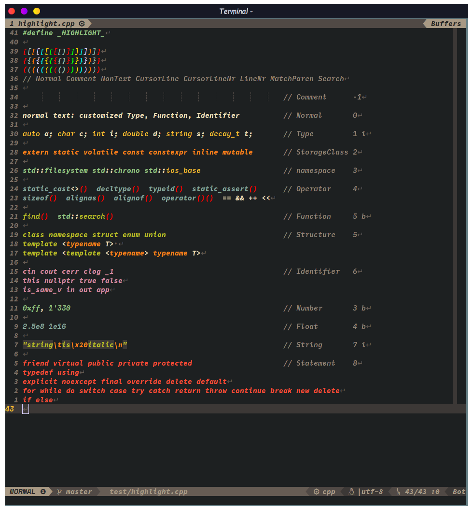
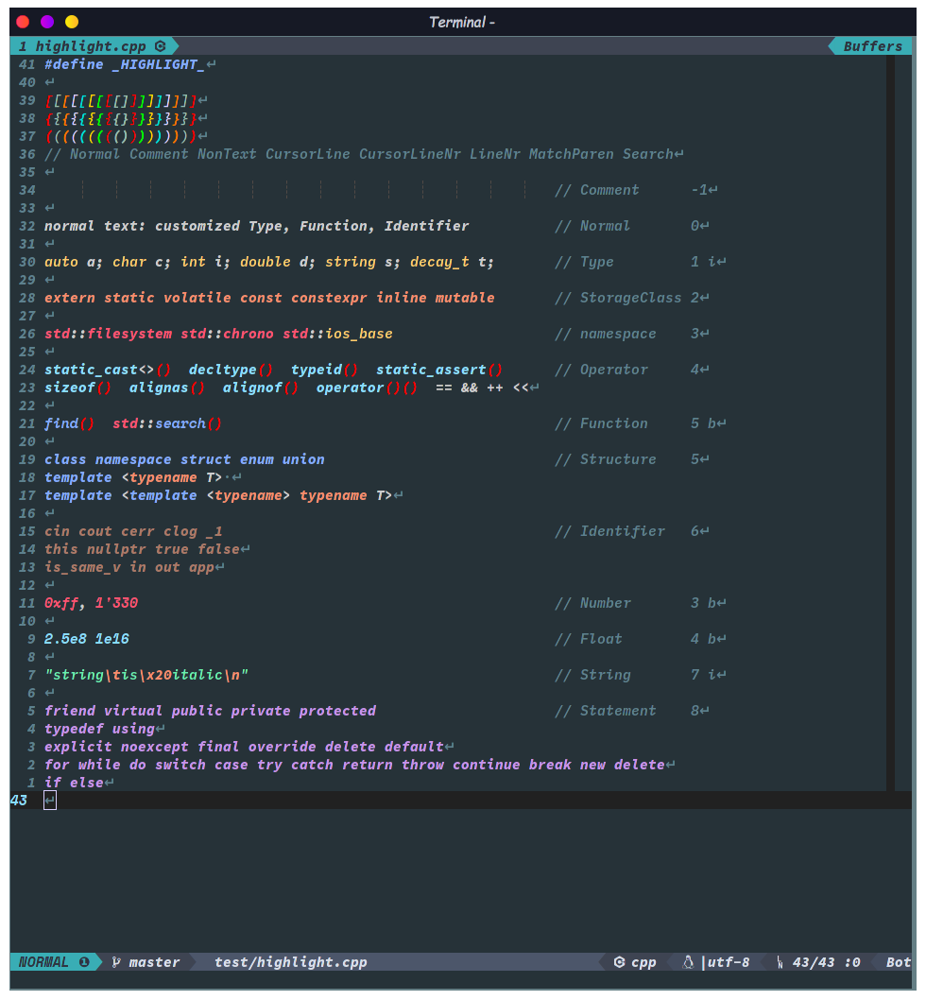
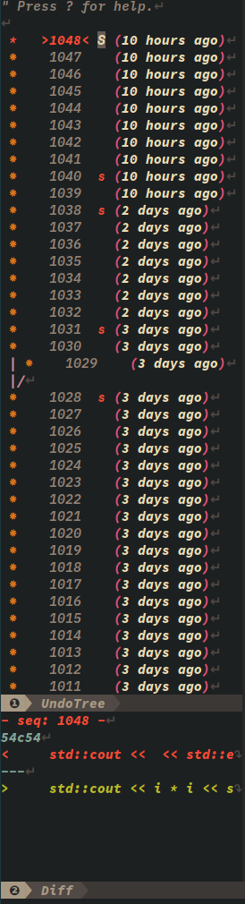

# 写在前面

&emsp;SpaceVim确实是个很棒的配置集合。相比于其他热门vim配置，它的文档更详细，开发更活跃。
而且模块化的设计使得用户可以更方便、更精准地进行自定义，魔改原配置。
虽然作者建议将custom配置写到单独的文件，但编辑器要用得顺手就是要配置的十分个性化嘛，
custom文件显然不能满足，于是就自己动手魔改呗。这时模块化配置就体现出优势了，哪里不顺改那里✺◟(∗❛ัᴗ❛ั∗)◞✺

* * *

几乎所有的快捷键都在[这个快捷键列表](https://github.com/mrbeardad/learning-notes-and-cheat-sheets/blob/master/notes/vim.md)中列出了，
里面包含了vim自带快捷键、SpaceVim原版快捷键、以及本魔改版快捷键

接下来就按一个个模块来讲解各种特性吧。先look~look我改了哪些地方  
  
**<p align="center">用Neovim结合该配置更棒哦</p>**

# 目录
<!-- vim-markdown-toc GFM -->

- [颜色主题](#颜色主题)
- [状态栏](#状态栏)
- [符号表、文件树、撤销树](#符号表文件树撤销树)
- [模糊搜索](#模糊搜索)
- [语法检测](#语法检测)
- [自动补全](#自动补全)
- [C模块](#c模块)
- [Markdown模块](#markdown模块)
- [安装](#安装)
  - [依赖](#依赖)
  - [安装指导](#安装指导)

<!-- vim-markdown-toc -->

# 颜色主题
&emsp;SpaceVim的***colorscheme模块***提供了不少颜色主题。我选取了其中几个比较好看的，
针对C\+\+语法高亮进行微调，当然也包括了对C\+\+语法高亮插件进行了微调。

&emsp;不同的是，C\+\+语法高亮插件的微调直接对插件本身进行了调整，
而对颜色主题的调整全都放在了[init.vim](init.vim)。所以想要使用微调过的颜色主题，
只有启动nvim时加载init.vim才行，而在开启后使用`:colorscheme`更换的主题是没有微调过的。

&emsp;需要在启动nvim时设置环境变量`DARKBG`，即执行`DARKBG=1 nvim`即可随机启用那些花里胡哨的主题，
不然默认使用透明背景主题default-plus。
要是觉得不方便，则可以简单修改一下[init.vim](init.vim)分支语句即可

PS：演示字体为[NerdCode](https://github.com/mrbeardad/DotFiles/tree/master/fonts)，是我将三种字体合成一个font family得到的。

**default-plus**  
  

**SpaceVim**  
  

**gruvbox**  
  

**NeoSolarized**  
  

**palenight**
  

**material**
  

# 状态栏

原版：  


定制版：  


**定制版从左至右依次是：**
1. 当前vim模式

2. 当前git分支
3. 当前文件路径（是指相对项目根目录的相对路径，若文件只读还会显示`🔒️`）
4. 文件类型
5. 文件格式 | 编码
6. 当前行号 / 总行数：当前列号
7. 屏幕显示的文本占比（接近文件内容边缘时会显示Bot或Top）

# 符号表、文件树、撤销树
&emsp;符号表插件使用的是[tagbar](https://github.com/wsdjep/tagbar)，按`<F1>`开启  
&emsp;文件树插件使用的是[defx](https://github.com/Shougo/defx.nvim)，按`<F3>`开启  
&emsp;撤销树插件使用的是[undotree](https://github.com/mbbill/undotree)，按`<F5>`开启  
</img>
</img>
</img>


# 模糊搜索
&emsp;该模块使用[Leaderf](https://github.com/Yggdroot/LeaderF)，可以搜索文件、内容、代码符号等等

| 按键               | 作用                    |
|--------------------|-------------------------|
| `<leader>fr`       | 重置上次搜索            |
| `<leader>f<space>` | 搜索快捷键并执行        |
| `<leader>fp`       | 搜索插件信息            |
| `<leader>fh`       | 搜索vim帮助文档         |
| `<leader>fq`       | 搜索quickfix            |
| `<leader>fl`       | 搜索locationlist        |
| `<leader>fm`       | 搜索vim的输出信息并复制 |
| `<leader>fu`       | 搜索unicode并插入       |
| `<leader>fj`       | 搜索跳转表并跳转        |
| `<leader>fy`       | 搜索"寄存器历史并复制   |
| `<leader>fe`       | 搜索所有寄存器并复制    |
| `<leader>ff`       | 搜索函数(尾缀F全局)     |
| `<leader>ft`       | 搜寻符号(尾缀T全局)     |
| `<leader>fg`       | 利用gtags搜寻标识符     |
| `<leader>fb`       | 搜索打开的缓冲区        |
| `<leader>for`      | 搜索最近打开文件        |
| `<leader>fod`      | 搜索当前目录文件        |
| `<leader>fof`      | 搜索指定目录            |
| `<leader>fop`      | 搜索当时工程目录文件    |

# 语法检测
&emsp;语法检测使用[ALE](https://github.com/dense-analysis/ale)插件，
会在底部命令行的位置显示报错与警告，
在边栏显示错误或警告图标，
在错误代码的位置下显示波浪线（若终端不支持undercurl则回滚为underline下划线）


选项：
* `g:ale_cpp_std` ：设置C++标准版本，默认值为`-std=c++17`
* `g:ale_c_std` ：设置C标准版本，默认值为`-std=c11`
* `g:ale_cpp_clangtidy_checks ` ：指定静态语法检测器clang-tidy
    所启用的[checks](https://clang.llvm.org/extra/clang-tidy/checks/list.html)，
    从而可以针对某一问题进行语法检测进而提示用户。

* `g:ale_clangtidy_period`  ：`clang-tidy`的启动周期，在init.vim中启用了绝大多数的checks，
    故它的检测速度相当感人。所以让它在一个周期内只启动一次。默认值为`6`，
    即每6次从插入模式退出到普通模式，只会触发一次clang-tidy，而gcc与cppcheck无此限制

* `g:ale_lint_on_*` ：这几个变量设置何时触发语法检测，用`:h`查看详细信息，
    默认只有`InsertLeave`退出插入模式才触发ALE检测（按`<c-c>`退出插入模式可不触发）

* `g:ale_sign_*`  ：这几个变量设置侧边栏显示的错误或警告图标，用`:h`查看详细信息

# 自动补全
&emsp;C++语义补全使用的[YCM](https://github.com/ycm-core/YouCompleteMe)，
可以帮你补全已引入头文件中的函数、变量、类、类成员等等。任意输入两个字母就自动打开补全列表，
`<tab>`与`<s-tab>`上下选择，`<cr>`完成选择。  
&emsp;刚引入的头文件还需待后台服务进行解析，
故其中的符号可能不会立刻出现在补全列表中，稍等即可。  


&emsp;除了语义补全，还有代码片段补全，插件为[UltiSnips](https://github.com/SirVer/ultisnips)。即按一定的语法编辑snippet配置文件后，再在代码中输入关键字，
然后按`<m-/>`（<kbd>Alt</kbd>+<kbd>/</kbd>）触发，就会将关键字替换为配置文件中的完整片段。  
&emsp;提供的默认片段位于[*UltiSnips*](UltiSnips)文件夹下

# C模块
&emsp;原生SpaceVim运行程序不会使用内建终端，而且脚本计时器的偏差有点大，所以我重新写了一个Linux平台的计时器，
输出漂漂亮亮的。  

&emsp;**命令：**  
* `QuickrunCompileFlag`：显示或设置当前文件的编译参数，例`QuickrunCompileFlag -std=c++20 -mavx2`  

* `QuickrunArgs`：显示或设置当前文件的运行时的命令行参数，例`QuickrunArgs -o file`  
* `QuickrunRedirect`：显示或设置当前文件的运行时重定向，例`QuickrunRedirect < file`

&emsp;**选项：**  
* `g:disable_auto_launch_gdb` ：若设置为1，则快捷键`<space>ld`仅编译用于调试的程序，而不会自动启动cgdb或gdb
* `g:quickrun_cpp_default_compile_flag ` ：设置编译C++文件时的参数，默认值为`-std=c++17`
* `g:quickrun_c_default_compile_flag `  ：设置编译C文件时的参数，默认值为`-std=c11`
* `g:quickrun_compileflag_extension_regex` ：设置条件扩展编译参数的正则表达式。见下
* `quickrun_compileflag_extension_flags`  ：设置条件扩展编译参数的参数内容。见下
```vim
let g:quickrun_compileflag_extension_regex =[
      \ '^\#include\s*<future>'
      \ ]
let g:quickrun_compileflag_extension_flags = [
      \ '-lpthread'
      \ ]
" 若文件中匹配到了正则表达式 '^\#include\s*<future>'
" 则语法检测以及运行该文件时会自动添加编译参数 '-lpthread'
" 两个列表中的regex与flags要相互对应，
" 同时注意vim字符串中的特殊字符如'#' '%' '/'等需要用反斜杠转义
```

| 按键        | 作用               |
|-------------|--------------------|
| `<space>lr` | 快速运行程序       |
| `<space>lc` | 关闭运行程序的终端 |
| `<space>li` | 快速打开输入窗口   |
| `<space>ld` | 启动cgdb或gdb调试  |
| `K`         | 利用cppman查询手册 |

&emsp;注意：`<space>li`快速打开窗口，会自动使用 QuickrunRedirect命令将当前buffer将要运行的程序重定向到该输入窗口。
离开输入窗口时会自动写回硬盘。

# Markdown模块
&emsp;[*UltiSnips目录*](UltiSnips)提供了一些markdown的代码补全片段。  
此外，还对markdown的语法高亮进行了调整；  
同时，提供了一些快捷键：

| 按键        | 作用                            |
|-------------|---------------------------------|
| `<space>lp` | 开启markdown预览（需要浏览器）  |
| `<space>lg` | 添加或删除GFM目录               |
| `<space>lk` | 利用系统剪切板的URL插入链接元素 |

注意：`WSL`与`WSL2`中也可打开浏览器进行预览哦，已经配置好了。

# 总结
&emsp;以上就是大概的定制化内容，还有不少比较杂的就不一一列出了。  
&emsp;现在，是不是有点手痒痒了呀？( ◔ ڼ ◔  )  
&emsp;哈哈，编辑器这东西就是要称手才好用，所以你也不可避免的需要修改一些内容。
接下来就简单说说怎么定制吧。

&emsp;首先，一部分我觉得用户可能会需要修改的配置都被放到了[init.vim](init.vim)里。  

&emsp;然后，如果init.vim里面没有内想要的该去哪找呢？这你的先看看[SpaceVim的官方文档](https://spacevim.org/documentation/)，
官方给的选项都需要在~/.SpaceVim.d/init.toml里添加配置，本仓库的init.toml在[mode目录下](mode/init.toml)

&emsp;要是还是没你想要的可咋办呀？这下你就得想想你需要修改为配置属于应该哪个模块，
模块所在目录在[autoload/SpaceVim/layers/](autoload/SpaceVim/layers/)，你也可以看[SpaceVim的官方文档的模块部分](https://spacevim.org/layers/)。
确定在哪后就去相应文件修改。模块配置文件大体分为两部分，插件加载部分在前面，配置部分在后面。

&emsp;若还是没找到，那就祭出终极杀器——用上面的模糊搜索模块直接搜整个项目，
快捷键`<leader>fp`搜索项目中的文件名，
快捷键`<space>sp`搜索项目中文件的内容

&emsp;最后，最简单的办法就是，给我提issue  
-“凎，为啥不早说？”  
-“(●'◡'●)ﾉ⭐️️”

SpaceVim目录：
autoload/   ：各种SpaceVim配置
autoload/SpaceVim/layers/ ：可用模块配置
config/plugins/     ：插件的配置
config/plugins_before/     ：插件的配置（在插件加载前加载）

# 安装

相比原生的SpaceVim需要自己配置，本魔改版本基本上算是开箱即用的，无需自己配置，
你需要做到就是好好阅读[**快捷键文档**](https://github.com/mrbeardad/learning-notes-and-cheat-sheets/blob/master/notes/vim.md)即可

接下来讲讲咋安装

## 依赖
首先，该配置有不少**依赖**需要装：

| 依赖包                    | 作用                              |
|---------------------------|-----------------------------------|
| xsel                      | neovim的系统剪切板交互            |
| python-pynvim             | neovim的python支持                |
| cmake                     | build YCM时需要                   |
| ripgrep                   | 模糊搜索模块的后端工具            |
| global与ctags             | 模糊搜索模块的符号索引            |
| npm或php                  | build markdown即时预览插件        |
| gcc、cppcheck、clang-tidy | 语法检测模块（gcc需要支持C++17）  |
| gdb与cgdb                 | 调试                              |
| cppman                    | 联网查询C++手册                   |

此外，想要更好的体验，需要将neovim运行在tmux中，你可以设置你喜欢的终端，使它启动时自动连接tmux。
[tmux的配置可以用这个](https://github.com/mrbeardad/DotFiles/blob/master/tmux/tmux.conf)，
此配置解决了tmux中的true-color与undercrul问题，不然你在tmux例运行neovim是很不美观的。

## 安装指导
**Only for Linux**

注意：执行前需要保证没有`~/.SpaceVim`目录，否则不会下载而直接进行其它步骤
```sh
# 方法一：
curl -fsSL https://github.com/mrbeardad/SpaceVim/raw/master/custom/install.sh | bash

# 方法二：
git clone --depth=1 https://github.com/mrbeardad/SpaceVim ~/.SpaceVim
cd ~/.SpaceVim
./custom/install.sh
```

安装操作会下载[颜色主题](#颜色主题)中提到的[NerdCode字体](https://github.com/mrbeardad/DotFiles/tree/master/fonts)，
同时下载cppman的cplusplus模式的缓存

安装完成后，还有两件事要做：
1. 打开nvim，执行`:SPInstall`安装插件
2. 执行`cp -f ~/.SpaceVim/custom/{clangtidy,cppcheck}.vim ~/.cache/vimfiles/repos/github.com/dense-analysis/ale/ale_linters/c/`修改ALE原配置
